# Mongodb
(cmd shift v)-para ver este doc

Base de datos popular, base de datos Nosql, orientada a documentos

## Tipos de base de datos Nosql

Documentales: empareja cada clave con una estructura de datos compleja que se denomina 'documento', aqui encontramos Mongo

Grafos: se usa para almacenar información sobre redes de datos, como las conexiones sociales, neo4j

clave-valor: son base de datos NoSQL mas simples. redis

orientadas a columnas: Como Cassandra o HBase, permite realizar consultas en grandes base de datos, almacena los datos en columnas en vez de filas.

## Características

facilidad para escalar, hay dos tipos de escalamiento: horizontal y vertical 

vertical: tenemos un servidos o maquina, aqui podemos aumentar las caracteristicas de la maquina para mayor almacenamiento, en estas se puede aumentar el espacio de almacenamiento y memoria ram,

horizontal: es diferente, al tener una de estas maquinas, la copiamos (como nodos), lo que garantiza disponibilidad, sistemas de replicación.

Al analizar ambos tipos de escalamiento tenemos varios tipos de beneficio entre costo y tiempo.

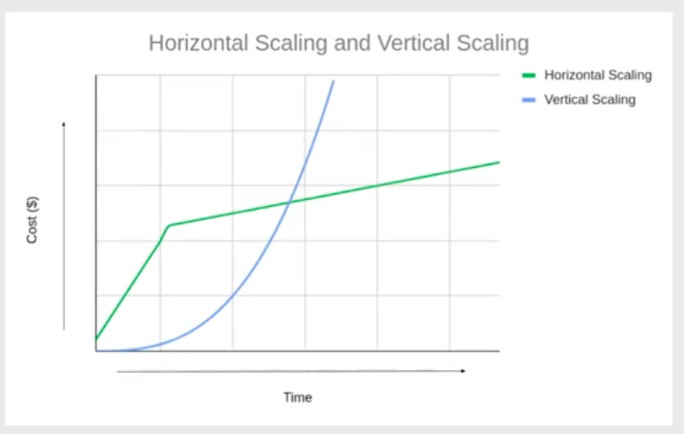

En la imagen podemos ver que el escalamiento vertial es más facil pero con el tiempo es más costoso.
mientras que con el escalamiento horizontal puede ser mas costoso en el inicio pero luego se mantiene estandar. 

los escalamientos son paradigmas

# Replicas

Las replicas en escalamiento horizontal, permite que si un nodo o replica falla, otra replica pueda realizar la consulta, esto lo llamariamos alta disponibilidad.

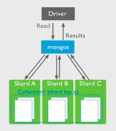

Por el contrario en un escalamiento vertival, si se cae el servidor, es la unica maquina, se cae el sistema. 

## DOCUMENTOS

Los documentos son la forma en que Mongo va a almacenar la información que este en un dominio o tener alli, un dominio como productos, inventario de una tienda, clases de un curso, comparten datos que podemos guardarlos en documentos que luego los almacenamos en colecciones.

Document: Una forma de organizar y almacenar información con un conjunto de pares clave- valor o (campo - valor)

# Cómo se ve?

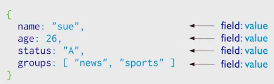

tenemos un documento que se abre con corchetes, en la imagen anterior podria ser la información de un estudiante. el campo - valor se separa por : 

otro ejemplo:

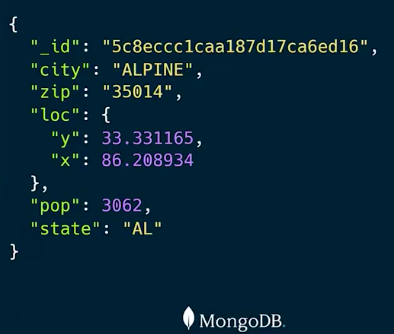

podemos tener sub documentos, por ejemplo en "loc" es un subdocumento o documento anidado con coordenadas, 

# Ejemplo

Una aplicación que queremos que guardelos contactos. en el escalamiento horizontal cada persona puede tener name, age, status y puede ocurrir que otro usuario tenga adicional estatura, lo cual no genera inconveniente con el escalamiento horizontal porque es flexible, el atributo se puede agregar sin mayor complicación, en el escalamiento vertical tendriamos que agregar una columna adicional y en algunos casos, queda vacio. 

Los documents pueden tener campos compartidos y un documento en particular puede tener un atributo adicional. 

## COLECCIONES

Los documents se almacenan en colecciones, los cuales comparten campos entre si. tienen una identidad o un modelo de datos que se relacionan, por ejemplo la colección de productos, en esta podríamos tener muchos documentos, o tambien una colección llamada usuarios que tenga todos los documentos de nuestros usuarios de nuestra aplicación. 

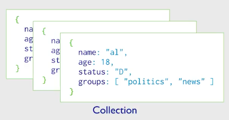

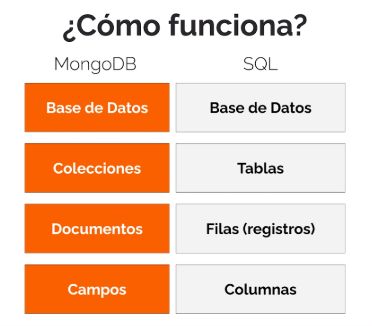

## CREACIÓN PRIMERA BD NoSQL

Implementaremos un servicio en la nube llamado: 

# Mongo Atlas

Mongo atlas ya trae organizado un sistema de clusterización, motor de Mongo y otras características

Modelo de escalamiento - Modelo de replicación

1. Se selecciona Free Cluster el cual es un plan gratuito

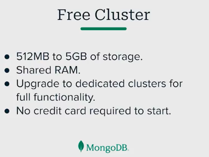

    Aquí cargaremos un set de datos. 
    Diferentes tipos demodelado y consultas.

2. Entramos a la pagina: mongodb.com

    Entramos a register: Sign in 
    seleccionamos la cuenta para registrarnos, en este caso lo haremos con cuenta gmail

    

    En la parte superior ziquierda aparece la estructura de organización:

    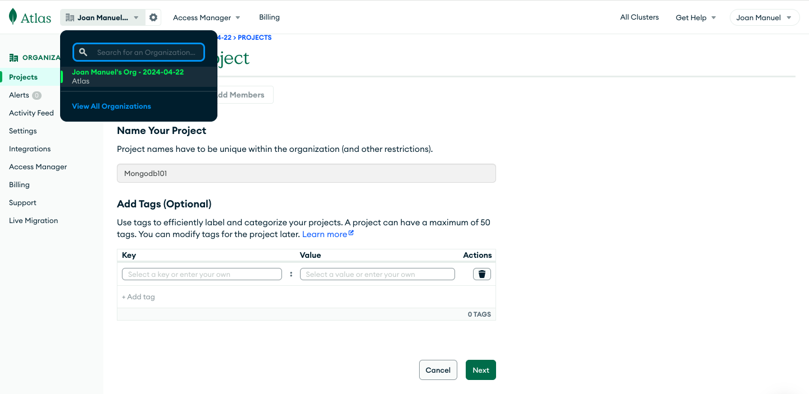

    Seguidamente estan los proyectos, 

    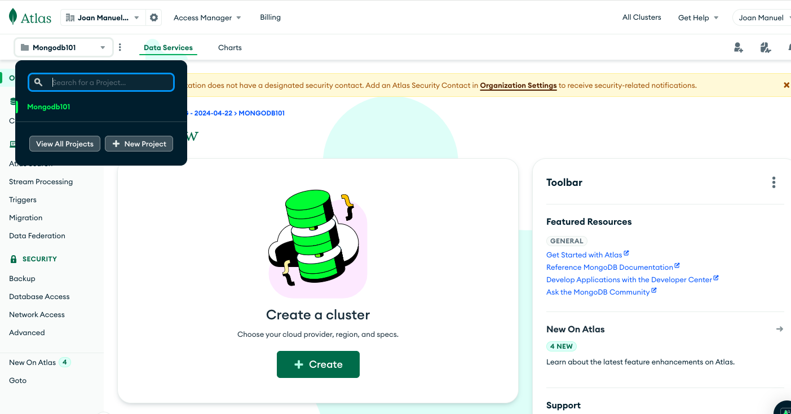

3. Creamos el Cluster, seleccionamos el servidor en la nube, por ejemplo AWS

4. Seleccionamos la region por ejemplo: us-east-1

5. Las credenciales son en este caso:
    username: joanflorez
    password: 95GTDiSVIt6EKiBX

6. Seleccionamos el metodo Atlas

7. En Quickstart,configuramos username: joanadmin, password: joanadmin123 , IP address: 0.0.0.0/0 description: Localhost

    damos crear

    Al entrar en la parte superior izquiera en clusters debe aparecer algo asi:

    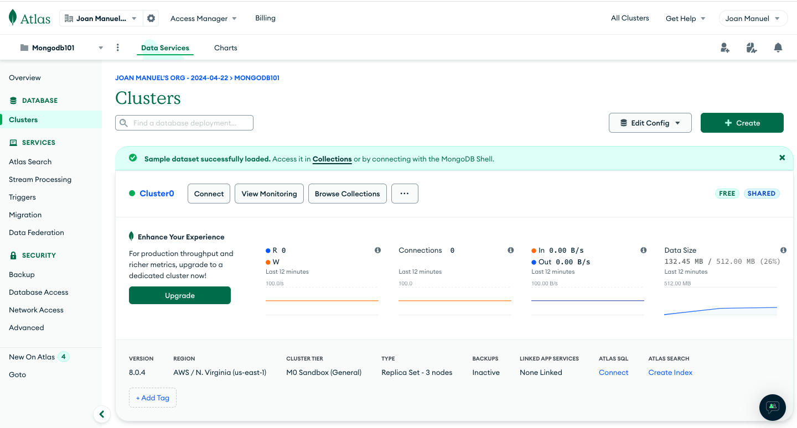

    Ya tenemos una base de datos bajo una estructura de organización y una estructura de proyectos (IMPORTANTE)
    Dentro de la organización por ejemplo: PLATZI, hay varios proyectos: Chats, IOT, etc

    En el boton de la derecha con tres puntos al lado de Browse Collections, seleccionamos: (Load Sample Dataset)

    En el siguiente link: 

    [Sample Datasets](https://www.mongodb.com/developer/products/atlas/atlas-sample-datasets/)

8. Ya podemos ver bases de datos en Browse Collections

    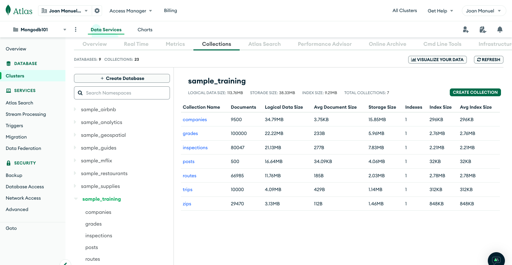

    Podemos ver que en Sample_training hay varias colecciones, por ejemplo companies tiene 9500 empresas

    Ya podemos empezar a explorar nuestra primera base de datos. 

## CONSULTAR INFORMACIÓN EN LA BASE DE DATOS

Usaremos Mongo Compass, una interfaz visual para hacer consultas y conectarnos a la base de datos. nos sirve para conectarnos a la nube o localmente. 

Entramos a Cluster y damos click en conect:

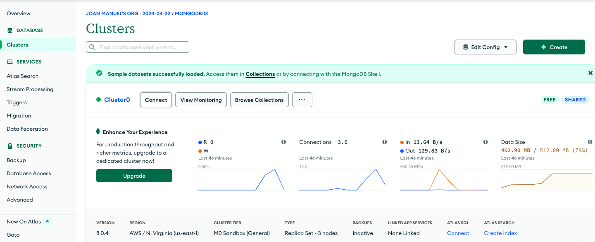

seleccionamos Compass

seleccionamos el sistema opertativo correcto.

instalamosy ejecutamos

seleccionamos el URI del paso 2 para ubicarlo en la conexión en Compass

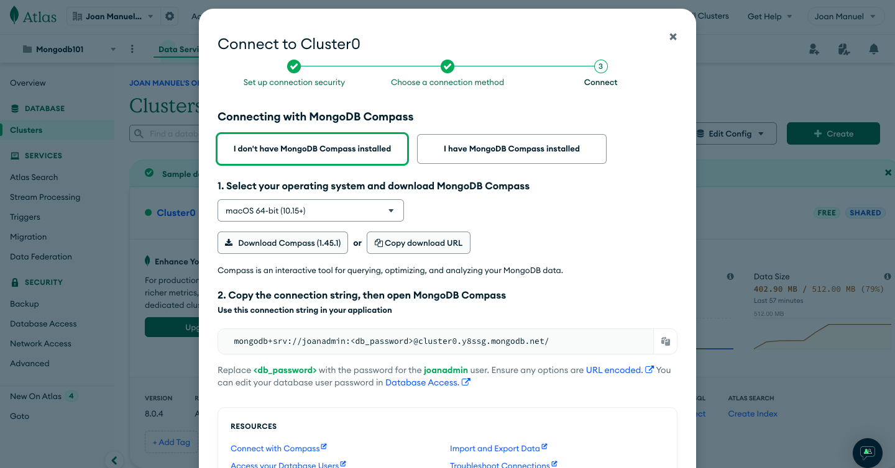

Al copiar la URI debemos escribir el password creado, en este caso: joanadmin123  sin <>
generamos la conexión 

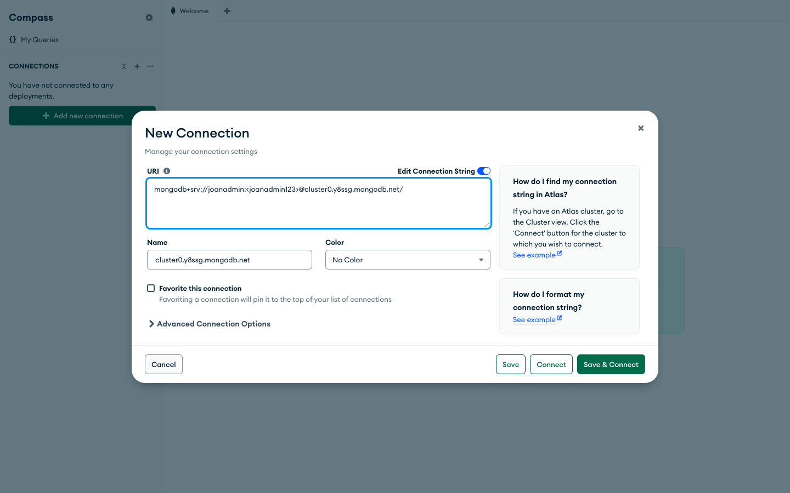

Podemos ver las conexiones locales:

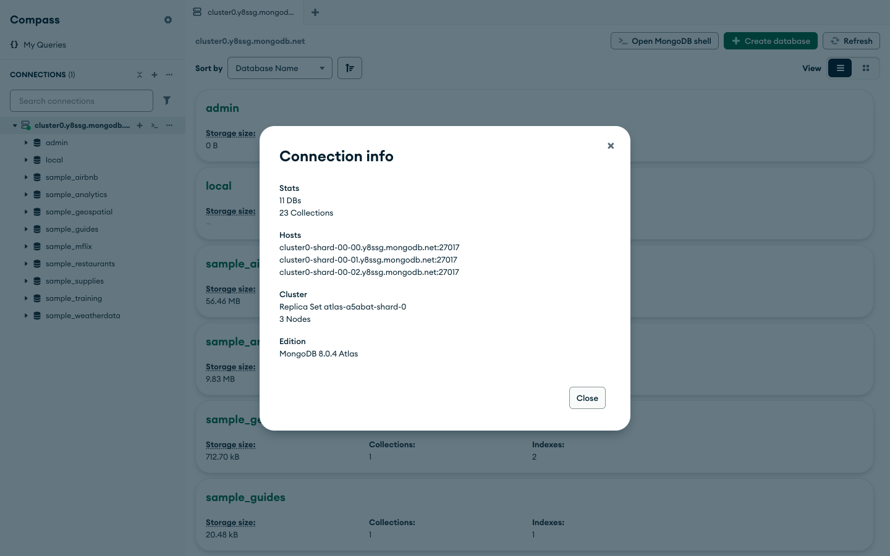

Le podemos cambiar el nombre desconectando la base de datos y podemos asignarle un color.
guardamos los cambios y volvemos a conectar.

seleccionamos sample_training

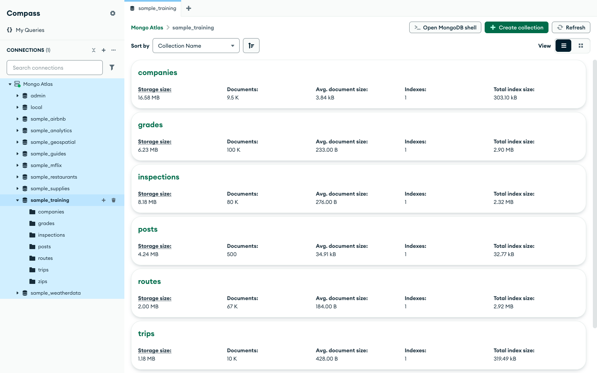

podemos entrar a la base de datos de trips, aqui podremos visualizar que tiene documentos. 

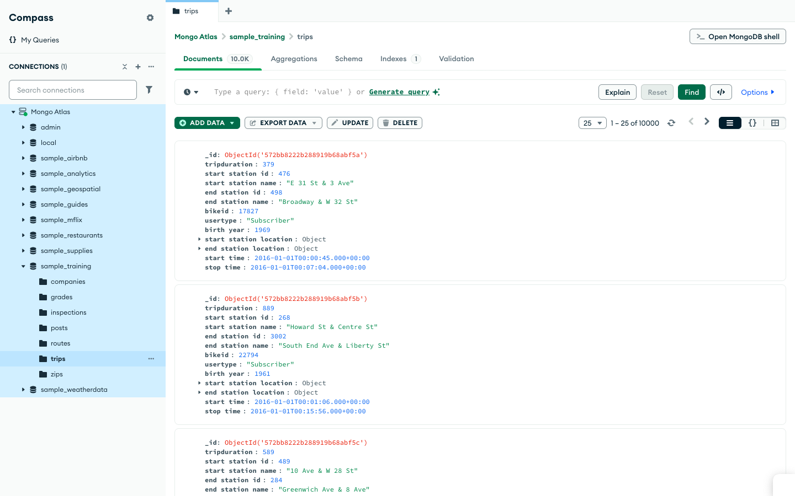

podemos consultar zips que son ciudades con locaciones y población (pop)

9. # Primer Query (consulta)

Este se realiza en compass en formato Json, 

En zips los que son del estado de NewYork

{ state: "NY" }

Arroja 1596 resultados:

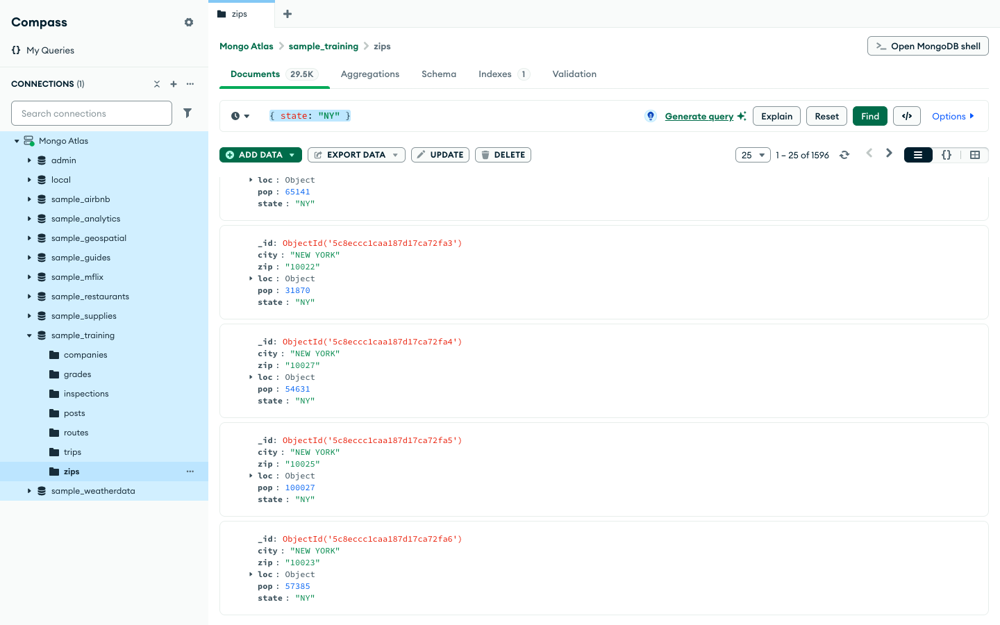

# Hasta aquí estamos usando Mongo Compass para hacer consultad en Mongo Atlas. 

## MONGO EN VSC

En esta sección realizaremos consultas desde la terminal en vsc, implementando Mongo Query Lenguage.

1. Creamos en la carpeta MONGODB_NOSQL una carpeta o directorio llamodo mongo_intro 
esto lo podemos hacer desde la terminal: mkdir mongo_intro

2. Seguidamente creamos los archivos del repositorio en mongo_intro.

.gitignore

[https://www.toptal.com/developers/gitignore](https://www.toptal.com/developers/gitignore)

En la pagina vamos escribir windows,linux,mac para que ignore este tipo de archivos

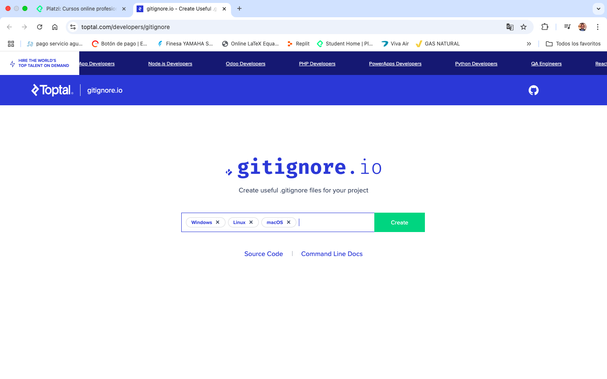
creamos el codigo, copiamos y pegamos en nuestro .gitignore
esto no va a permitir que suban archivos basura a nuestro repositorio.

.editorconfig

El codigo lo obtendremos del siguiente repositorio:

[https://github.com/platzi/curso-mongodb-intro](https://github.com/platzi/curso-mongodb-intro)

Este codigo es para manejo estandar de espacios, tablas etc en automatico.

# Archivos para generar al extensión desde VSC con Mongo

En la pagina de Mongo, entramos a products

[https://www.mongodb.com/](https://www.mongodb.com/)

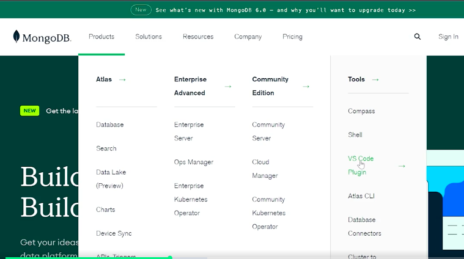

podemos instalar desde la pagina o directamente desde VSC

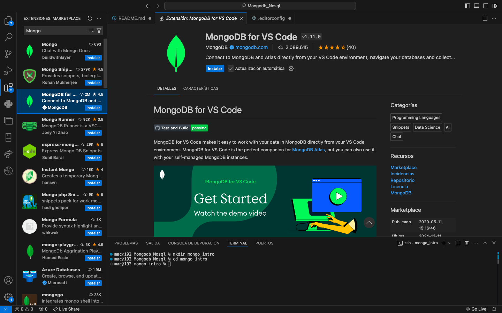
cmd shift p (para abrir los comandos de mongo)

Es recomendable reiniciar VSC para la correcta instalación de la extensión

3. Iniciamos la conexión. Add Connection

Inicimos la conexión en Connetion String
buscamos la url en Mongo Atlas: Entramos en Mongo en conect -> compass
recuerde introducir el pass: joanadmin123
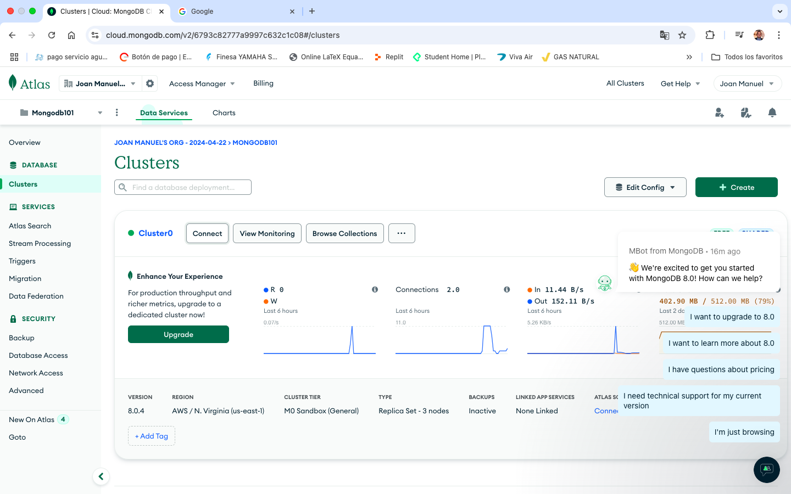

ya esta la conexión!!
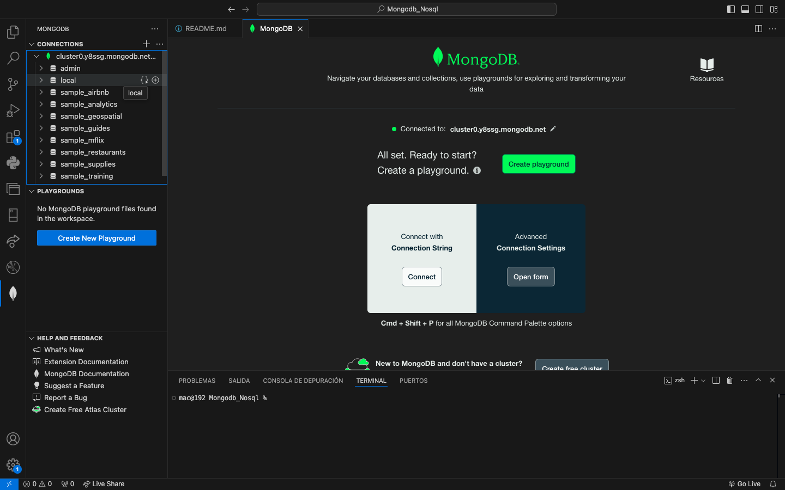

se puede renombrar el archivo, por ejemplo: Mongo_Atlas

Podemos explorar todos los documentos. 

4. Creamos la carpeta src, y en la carpeta creamos una subcarptea 01_plaground y aqui creamos el archivo query.mongodb

Aqui yya podemos correr codigo de consulta desde la teminal

El codigo que escribamos en query.mongodb se puede ejecutar con el boton play en la parte superior derecha. 

5. Creamos un repositirio para ver nuestras consultas.

Toda la info que en el siguiente repositorio

[https://github.com/platzi/curso-mongodb-intro](https://github.com/platzi/curso-mongodb-intro)

# Dataset:

[https://gist.github.com/nicobytes/fbd8c63977217855ba8afd3e240651c9text](https://gist.github.com/nicobytes/fbd8c63977217855ba8afd3e240651c9)

6. Realizamos la conexión:

git init

git remote add origin git@github.com:joanflorez-alt/Mongo-Atlas_01.git

# primer comit

git add . 

git commit -m "start project"

git rebase --continue

git status

git push origin main --force

